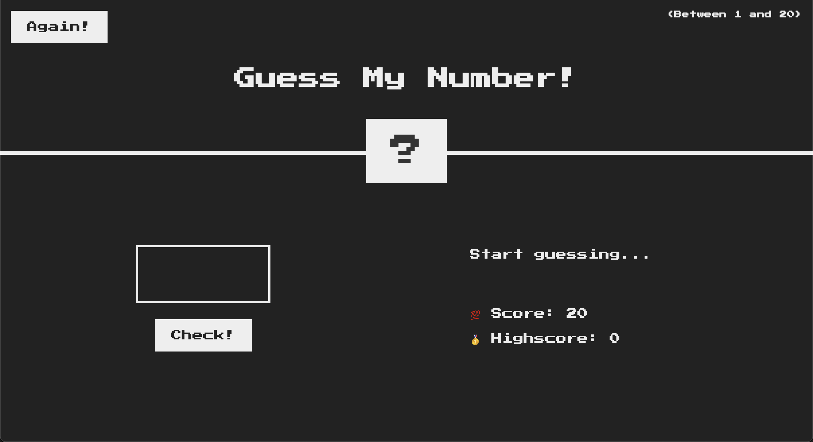
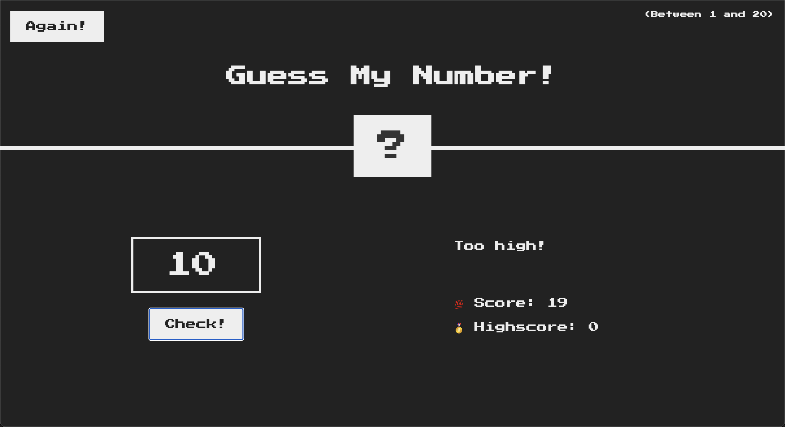
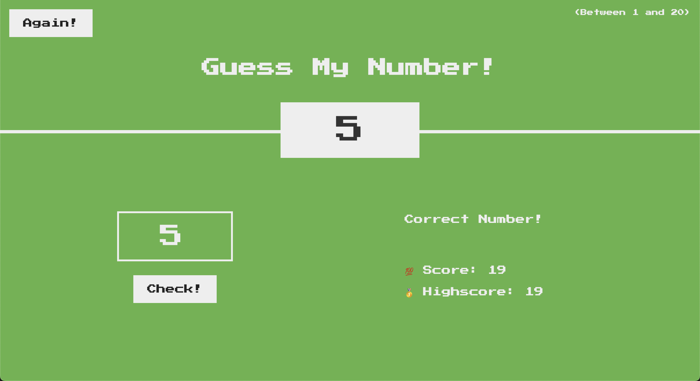

# Guess My Number Game

GuessMyNumber is a game that user has to guess the correct number between 1 and 20.
It is developed using HTML, CSS and JavaScript.
It is a small JavaScript project for beginners which includes DOM manipulation.

